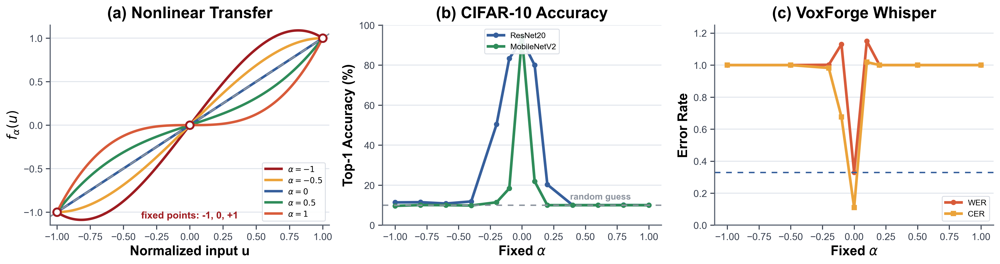
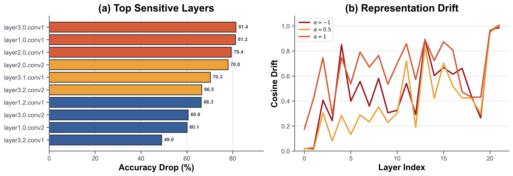
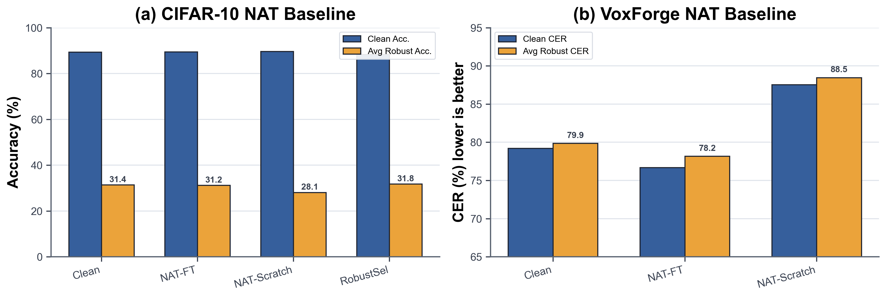
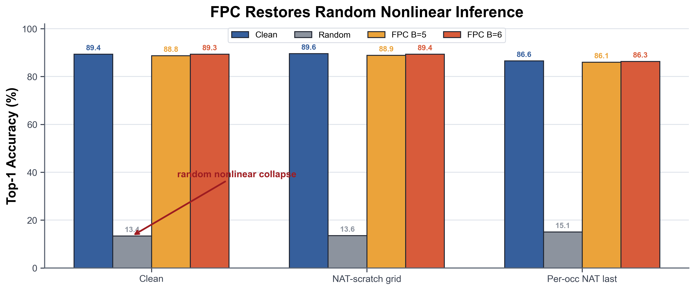
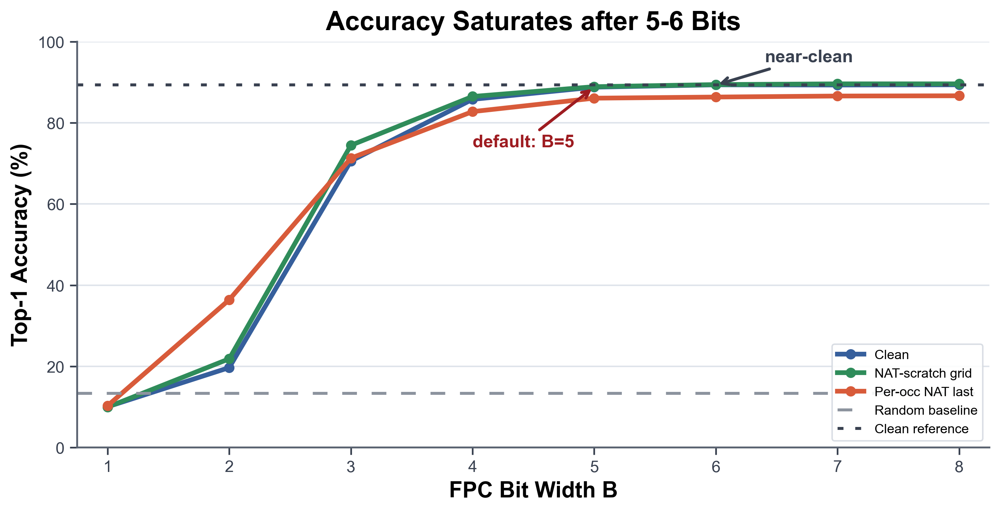
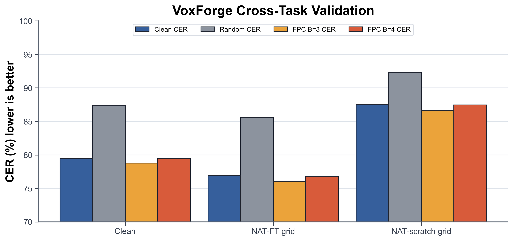
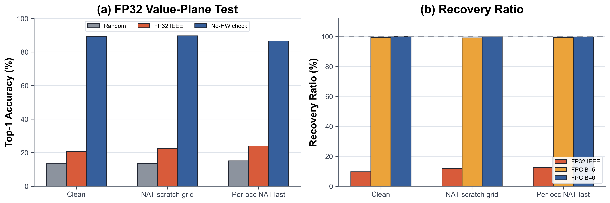
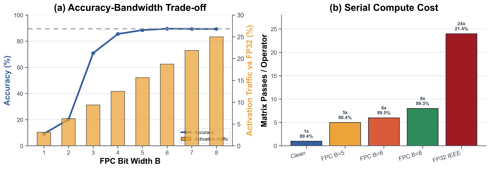

# 面向存算一体神经网络部署的非线性误差敏感性分析与固定点位串行鲁棒编码

作者：innoCIM 实验项目组  
日期：2026-07-08

## 摘要

存算一体硬件能够降低神经网络推理中的数据搬移成本，但模拟输入端、阵列器件和外围电路的非理想响应会引入输入相关的非线性误差。与普通加性噪声不同，这类误差会随激活幅值和算子位置发生系统性变化，并可能在深层网络中逐层累积，导致部署精度快速崩溃。本文围绕赛题给定的三次非线性函数，系统研究了存算一体矩阵算子输入端非线性对视觉分类和语音识别模型的影响，并进一步提出固定点位串行编码（Fixed-Point Bit-Serial Coding, FPC）作为推理阶段的鲁棒编码机制。

本文首先在 CIFAR-10 图像分类和 VoxForge Spanish 语音识别任务上完成非线性误差敏感性分析。实验表明，CIFAR-10 上 ResNet20 和 MobileNetV2 在强非线性下均会退化到接近随机猜测；Whisper-tiny 在 VoxForge 上对弱非线性更加敏感，`alpha=±0.1` 即可使 WER 从 clean 条件下的 `0.3293` 上升到 `1.13` 左右。进一步的单层敏感性和激活漂移分析显示，高敏感层集中在 stage 起始层、中后部卷积层和 Transformer encoder 早期投影层，误差会同时破坏激活幅值和特征方向。

随后，本文研究非线性感知训练（Nonlinearity-Aware Training, NAT）。结果显示，NAT fine-tuning 可以在一定程度上保持 clean 性能并改善局部扰动范围内的鲁棒性，但仅依靠训练闭环并不足以解决随机、逐算子、未知 `alpha` 的推理不稳定问题。在严格 `alpha~Uniform(-1,1)`、每算子每次 forward 独立采样的条件下，从零开始的 NAT 训练仍无法稳定抵抗裸随机非线性。

为解决该问题，本文提出 FPC：将进入存算阵列的连续激活拆成固定点 bit-plane，使每个 bit-plane 的输入脉冲落在非线性函数的不动点 `{ -1, 0, +1 }` 上，从而把未知模拟非线性误差转化为可控的 bit 精度误差。CIFAR-10 实验显示，在 clean checkpoint 上，裸随机非线性将精度从 `89.38%` 降至 `13.37%`，而 FPC `B=5` 可恢复至 `88.77%`，FPC `B=6` 可恢复至 `89.35%`。在严格 per-occurrence NAT last checkpoint 上，裸随机非线性仍仅有 `15.10%` mean accuracy，而 FPC `B=8` 达到 `86.65%`，接近该 checkpoint 的 clean `86.59%`。VoxForge 小规模跨任务验证呈现相同趋势。作为反例，标准 FP32 IEEE754 value-plane 分解在无硬件非线性时可精确还原 clean forward，但进入随机非线性硬件后只能恢复到约 `20%-26%`，显著弱于 FPC。

综合精度和效率，本文建议将 FPC `B=5` 作为默认部署点，将 `B=6` 作为高精度部署点。FPC `B=5` 仅需 FP32 激活流量的 `15.625%`，FPC `B=6` 仅需 `18.75%`，同时可保持接近 clean 的推理性能。本文结论表明，面向存算一体的鲁棒部署不应只依赖训练补偿，还需要利用硬件非线性函数结构设计计算编码，使模拟非理想性在编码层面被消除或受控。

**关键词**：存算一体；非线性误差；非线性感知训练；固定点位串行编码；鲁棒推理；CIFAR-10；VoxForge

## 1. 引言

深度神经网络推理通常由大规模矩阵乘法和卷积运算主导。传统数字硬件需要在存储器和计算单元之间频繁搬移权重与激活，能耗和带宽压力随模型规模快速增长。存算一体（Compute-in-Memory, CIM）架构通过在存储阵列附近或阵列内部完成乘加运算，能够减少数据搬移，是边缘智能和低功耗推理的重要方向。

然而，CIM 硬件通常包含模拟或混合信号计算过程。激活输入的电压、电流或脉冲宽度在进入阵列前可能经过非理想转换，阵列单元和外围电路也可能表现出非线性响应。对于神经网络而言，这种误差不是简单的独立同分布噪声，而是输入相关、层相关、方向相关的系统性失真。一旦在多个矩阵算子中重复出现，误差会在深层表示中累积，最终改变 logits 排序或序列解码路径。

本文关注如下核心问题：

1. 给定输入相关三次非线性函数，神经网络推理性能会如何退化？
2. 哪些层和哪些任务更容易放大非线性误差？
3. 将非线性扰动加入训练闭环，能否直接解决部署问题？
4. 若训练补偿不足，是否可以设计推理编码，使硬件非线性不再破坏矩阵计算？
5. 与直观的 FP32 二进制 bit 串方案相比，固定点 bit-plane 是否具有真正的鲁棒优势？
6. FPC 的 bit 位宽如何影响精度、激活流量和串行计算代价？

本文的主要贡献如下：

1. 建立了覆盖 CIFAR-10 图像分类、VoxForge Spanish 语音识别、层级敏感性、激活漂移和训练闭环的非线性误差评估框架。
2. 证明赛题给定的三次非线性会在整网推理中造成严重精度坍塌，并且 ASR 任务比图像分类更脆弱。
3. 评估 clean training、NAT fine-tuning、NAT from scratch 和 robust-selected NAT，指出 NAT 是可行但不足以单独解决未知随机非线性部署问题。
4. 提出并验证 FPC，通过固定点 bit-plane 的端点不变量，把随机模拟非线性误差转化为可控量化误差。
5. 给出 FP32 IEEE754 value-plane 反例，说明“存储 bit 串”不等于“鲁棒计算编码”。
6. 给出 FPC bit 位宽的精度与效率权衡，推荐 `B=5` 和 `B=6` 作为主要部署配置。

## 2. 非线性误差模型

赛题给定的输入端非线性映射为：

$$
f_\alpha(u)=\alpha u^3+(1-\alpha)u,
$$

其中 `u` 表示归一化后的矩阵算子输入，`alpha` 表示硬件非线性强度和方向。该函数满足：

$$
f_\alpha(-1)=-1,\quad f_\alpha(0)=0,\quad f_\alpha(1)=1.
$$

因此，`-1`、`0`、`1` 是该非线性函数对任意 `alpha` 都成立的不动点。这个性质是 FPC 的基础。普通连续激活通常落在 `(-1,1)` 内部，经过 `f_alpha` 后会发生幅值和方向相关的改变；而若输入脉冲被编码成 `{ -1, 0, +1 }`，则硬件非线性无法改变该脉冲值。

图 1 给出非线性函数形状以及跨任务整网敏感性摘要。



图 1 左侧显示，当 `alpha` 从负值变化到正值时，曲线在区间内部发生明显弯曲，但端点和零点保持不变。中间的 CIFAR-10 结果显示，ResNet20 和 MobileNetV2 在 clean 条件下精度较高，但在强非线性下均接近随机猜测。右侧的 VoxForge Whisper-tiny 结果显示，ASR 任务在 `alpha=±0.1` 的弱扰动下已经明显失效。

## 3. 方法

### 3.1 算子输入端非线性注入

本文将非线性注入位置设定为矩阵计算算子的输入端，覆盖如下算子：

| 算子类型 | 注入位置 |
|---|---|
| `Conv1d` | 卷积输入激活 |
| `Conv2d` | 卷积输入激活 |
| `ConvTranspose1d` | 转置卷积输入激活 |
| `ConvTranspose2d` | 转置卷积输入激活 |
| `Linear` | 全连接输入激活 |

对于输入张量 `x`，先按张量局部尺度归一化到 `[-1,1]`，经过 `f_alpha` 后再反归一化回原尺度，送入原算子。该实现保留原模型权重和结构，仅改变矩阵算子输入端响应。

### 3.2 非线性感知训练

NAT 将同一非线性映射加入训练 forward，使模型在训练过程中接触硬件误差。本文评估三类训练策略：

| 策略 | 初始化 | 目标 |
|---|---|---|
| Clean training | 随机初始化 | 得到无扰动 baseline |
| NAT fine-tuning | clean checkpoint | 低成本硬件适配 |
| NAT from scratch | 随机初始化 | 端到端鲁棒训练 |

早期任务二实验使用 per-tensor `alpha` 和较窄训练范围，以验证训练闭环是否可行；任务三进一步引入严格 per-occurrence 随机协议，即每个目标算子、每次 forward 调用独立采样：

$$
\alpha_{l,c}\sim Uniform(-1,1).
$$

该设置更接近未知硬件误差在真实部署中的随机出现方式。

### 3.3 固定点位串行编码

FPC 的目标不是估计 `alpha`，也不是对非线性误差做均值补偿，而是改变输入到存算阵列的表示方式。设归一化激活为 `u`，FPC 将其量化为 `B` bit 固定点数，并拆分为多个 bit-plane。每个 bit-plane 只向阵列输入 `{-1,0,+1}` 形式的脉冲：

$$
p_i = sign(u)\cdot bit_i(q)\cdot M,
$$

其中 `bit_i(q)` 为量化整数第 `i` 位，`M` 是对应归一化幅值端点。由于 `{ -1,0,+1 }` 是 `f_alpha` 的不动点，对任意 `alpha` 都有：

$$
f_\alpha(p_i)=p_i.
$$

矩阵算子对各 bit-plane 分别执行 partial forward，再按二进制权重数字累加。这样，普通模拟非线性误差不再作用于连续激活内部值，而只剩下固定点量化误差和 bit 位宽带来的近似误差。

### 3.4 FP32 IEEE754 value-plane 对照

用户进一步要求验证“标准 FP32 IEEE754 二进制 bit 串”方案。需要注意，IEEE754 的 1-bit sign、8-bit exponent、23-bit mantissa 是存储格式，不是直接可线性相加的固定点数值平面。为了构造公平可执行的对照实验，本文将 FP32 normal number 解析为：

$$
FP32=(-1)^{sign}\cdot 2^{exponent-127}\cdot (1+mantissa/2^{23}),
$$

并拆分为 implicit leading 1 plane 和 23 个 mantissa contribution plane，共 24 个数值贡献平面。在无硬件非线性时，这些 value-plane 相加可精确还原原始 FP32 activation；在随机硬件非线性下，每个 value-plane 仍会被 `f_alpha` 改变。

该实验用于回答：仅仅把 FP32 存储值拆成二进制数值平面，是否能获得类似 FPC 的鲁棒性。

## 4. 实验设置

### 4.1 数据集与模型

本文覆盖图像分类和语音识别两类任务。

| 任务 | 数据集 | 模型 | 主要指标 |
|---|---|---|---|
| 图像分类 | CIFAR-10 | ResNet20, MobileNetV2 | Top-1 Accuracy, Loss |
| ASR 推理敏感性 | VoxForge Spanish | Whisper-tiny | WER, CER |
| ASR 训练闭环 | VoxForge Spanish | CRNN-CTC | WER, CER, CTC Loss |

CIFAR-10 主评估使用 ResNet20，因为其参数量较小、训练和层级分析成本可控，同时具有典型残差结构。MobileNetV2 用于对比参数量和结构对非线性鲁棒性的影响。VoxForge Whisper-tiny 用于任务一推理敏感性分析，CRNN-CTC 用于任务二训练闭环。

### 4.2 评价指标

分类任务使用：

| 指标 | 含义 |
|---|---|
| Clean Accuracy | `alpha=0` 或无非线性条件下的准确率 |
| Mean Accuracy | alpha 网格上的平均准确率 |
| Worst Accuracy | alpha 网格上的最差准确率 |
| Max Accuracy Drop | clean accuracy 与 worst accuracy 的差值 |
| Recovery Ratio | 编码恢复的 clean-random 精度损失比例 |

语音识别任务使用：

| 指标 | 含义 |
|---|---|
| WER | Word Error Rate，越低越好 |
| CER | Character Error Rate，越低越好 |
| Avg Robust CER | 非 clean alpha 点上的平均 CER |
| Worst CER | alpha 网格上的最差 CER |

层级分析使用 relative L2、cosine drift、JS divergence、mean shift 和 std ratio 等指标，用于观察激活分布和表示方向如何变化。

## 5. 非线性误差敏感性分析

### 5.1 CIFAR-10 整网退化

表 1 汇总 CIFAR-10 两个分类模型在 alpha 扫描下的整体鲁棒性。

**表 1：CIFAR-10 整网非线性鲁棒性汇总**

| 模型 | Clean Accuracy | Mean Accuracy | Worst Accuracy | Max Drop | 参数量 | 注入算子数 |
|---|---:|---:|---:|---:|---:|---:|
| MobileNetV2 | 0.9405 | 0.1810 | 0.0965 | 0.8440 | 2,236,682 | 53 |
| ResNet20 | 0.9259 | 0.3171 | 0.1000 | 0.8259 | 272,474 | 22 |

结果显示，两个模型在 clean 条件下均具有较高准确率，但在强非线性下都会退化到约 `0.10`，接近 CIFAR-10 十分类随机猜测水平。值得注意的是，参数量更大的 MobileNetV2 并没有表现出更强鲁棒性，其 mean accuracy 反而明显低于 ResNet20。这说明非线性鲁棒性与参数量没有简单正相关，更受算子链条、残差路径、归一化结构和 depthwise/pointwise 组合方式影响。

### 5.2 VoxForge Whisper-tiny 推理敏感性

表 2 给出 Whisper-tiny 在 VoxForge Spanish 32 条样本上的 alpha 扫描结果。

**表 2：VoxForge Whisper-tiny 非线性推理结果**

| Alpha | WER | CER | 样本数 |
|---:|---:|---:|---:|
| -1.0 | 1.0000 | 1.0000 | 32 |
| -0.5 | 1.0000 | 1.0000 | 32 |
| -0.2 | 1.0017 | 0.9820 | 32 |
| -0.1 | 1.1304 | 0.6764 | 32 |
| 0.0 | 0.3293 | 0.1102 | 32 |
| 0.1 | 1.1492 | 1.0188 | 32 |
| 0.2 | 1.0000 | 1.0000 | 32 |
| 0.5 | 1.0000 | 1.0000 | 32 |
| 1.0 | 1.0000 | 1.0000 | 32 |

ASR 对非线性误差更脆弱。Whisper-tiny 在 clean 条件下 WER 为 `0.3293`，CER 为 `0.1102`；当 `alpha=±0.1` 时，WER 已超过 `1.0`。这是因为 ASR 的误差传播链条更长：前端声学特征扰动会影响 encoder 表示，再经过 decoder 的自回归生成过程进一步放大。

### 5.3 单层敏感性与表示漂移

整网退化说明模型会失效，但不能解释失效从哪里开始。图 2 将 ResNet20 的单层敏感性和全网表示漂移放在同一视角下。



表 3 列出 `alpha=1.0` 下 ResNet20 最敏感的层。

**表 3：ResNet20 在 alpha=1.0 下的单层敏感性**

| 排名 | 层 | 单层注入后 Accuracy | Accuracy Drop |
|---:|---|---:|---:|
| 1 | `layer3.0.conv1` | 0.1089 | 0.8145 |
| 2 | `layer1.0.conv1` | 0.1113 | 0.8120 |
| 3 | `layer2.0.conv1` | 0.1294 | 0.7939 |
| 4 | `layer2.0.conv2` | 0.1436 | 0.7798 |
| 5 | `layer3.1.conv1` | 0.2207 | 0.7026 |
| 6 | `layer3.2.conv2` | 0.2583 | 0.6650 |

高敏感层主要出现在 stage 起始层和中后部卷积层。这些层通常负责特征尺度或语义阶段转换，输入分布一旦发生非线性偏移，会影响后续整个 stage。逐层 drift 结果进一步显示，负 `alpha` 更容易造成幅值尺度失控，正 `alpha` 更明显破坏特征方向；两者都会使最终分类边界失效。

## 6. 非线性感知训练实验

### 6.1 CIFAR-10 NAT 结果

图 3 汇总 CIFAR-10 与 VoxForge 的 NAT baseline。



表 4 给出 CIFAR-10 ResNet20 在任务二训练设置下的结果。

**表 4：CIFAR-10 NAT 方法汇总**

| 方法 | Epoch | Clean Acc | Avg Robust Acc | Worst Acc | Max Drop |
|---|---:|---:|---:|---:|---:|
| Clean | 60 | 0.8939 | 0.3141 | 0.1000 | 0.7939 |
| NAT Fine-tuning | 20 | 0.8941 | 0.3122 | 0.1079 | 0.7862 |
| NAT From Scratch | 60 | 0.8965 | 0.2812 | 0.0935 | 0.8030 |
| NAT FT Robust-selected | 20 | 0.8832 | 0.3176 | 0.1000 | 0.7832 |

普通 NAT fine-tuning 可以保持 clean accuracy，但平均鲁棒精度没有明显提升。Robust-selected NAT 通过在验证阶段使用鲁棒指标选择 checkpoint，使 avg robust accuracy 从 `0.3122` 提升到 `0.3176`，但 clean accuracy 从 `0.8941` 降到 `0.8832`。这说明 NAT 的收益依赖训练扰动范围和 checkpoint 选择指标，不能简单认为“加入扰动训练”必然提升所有鲁棒指标。

### 6.2 VoxForge NAT 结果

表 5 给出 VoxForge CRNN-CTC 小规模训练闭环结果。

**表 5：VoxForge NAT 方法汇总**

| 方法 | Epoch | Train/Val/Test | Clean WER | Clean CER | Avg Robust WER | Avg Robust CER | Worst CER |
|---|---:|---|---:|---:|---:|---:|---:|
| Clean | 30 | 120/30/30 | 0.9956 | 0.7920 | 0.9884 | 0.7985 | 0.8246 |
| NAT Fine-tuning | 10 | 120/30/30 | 0.9913 | 0.7669 | 0.9891 | 0.7817 | 0.8079 |
| NAT From Scratch | 30 | 120/30/30 | 0.9956 | 0.8755 | 0.9934 | 0.8847 | 0.9165 |

在当前小规模 ASR 设置下，WER 接近 `1.0`，不能单独作为模型质量判断依据。CER 更能反映字符级学习状态。NAT fine-tuning 将 clean CER 从 `0.7920` 降至 `0.7669`，将 avg robust CER 从 `0.7985` 降至 `0.7817`，说明语音模型在字符级输出上可以从非线性扰动训练中获益。NAT from scratch 表现较差，说明从零训练需要更大数据规模、更长 epoch 或 curriculum alpha。

### 6.3 NAT 的阶段性结论

NAT 的价值在于把硬件误差纳入训练闭环，使模型学习一定范围内的误差适应能力。但本文实验也表明：

1. NAT fine-tuning 比 NAT from scratch 更稳定，特别是在数据和训练预算有限时。
2. 只按 clean validation accuracy 选 checkpoint 会偏向 clean 性能，鲁棒性收益有限。
3. Robust validation 可以改善部分扰动方向，但可能牺牲 clean 或另一方向的 alpha 性能。
4. 当 `alpha` 在 `[-1,1]` 内逐算子随机出现时，仅依靠训练补偿仍不能稳定解决裸随机非线性。

因此，NAT 更适合作为部署适配的一部分，而不是唯一的鲁棒性机制。

## 7. 固定点位串行编码实验

### 7.1 CIFAR-10 主结果

图 4 给出 CIFAR-10 主实验中 clean、裸随机非线性和 FPC 的对比。



表 6 汇总多个 checkpoint 上的 FPC 恢复效果。

**表 6：CIFAR-10 FPC 主结果**

| Checkpoint | Clean Acc | Random Mean Acc | Random Worst Acc | FPC B=4 | FPC B=5 | FPC B=6 | FPC B=8 | B5 Recovery | B6 Recovery |
|---|---:|---:|---:|---:|---:|---:|---:|---:|---:|
| Clean | 0.8938 | 0.1337 | 0.1184 | 0.8577 | 0.8877 | 0.8935 | 0.8936 | 0.9920 | 0.9996 |
| NAT-FT grid | 0.8940 | 0.1300 | 0.1151 | 0.8617 | 0.8886 | 0.8922 | 0.8948 | 0.9929 | 0.9976 |
| NAT-scratch grid | 0.8964 | 0.1355 | 0.1223 | 0.8648 | 0.8889 | 0.8941 | 0.8959 | 0.9901 | 0.9970 |
| RobustSel grid | 0.8833 | 0.1317 | 0.1184 | 0.8415 | 0.8730 | 0.8819 | 0.8822 | 0.9863 | 0.9981 |
| Per-occ NAT best | 0.7737 | 0.1622 | 0.1358 | 0.7567 | 0.7698 | 0.7743 | 0.7745 | 0.9936 | 1.0010 |
| Per-occ NAT last | 0.8659 | 0.1510 | 0.1260 | 0.8275 | 0.8606 | 0.8634 | 0.8665 | 0.9926 | 0.9965 |

表中 recovery ratio 定义为：

$$
Recovery=\frac{Acc_{FPC}-Acc_{random}}{Acc_{clean}-Acc_{random}}.
$$

结果表明，裸随机非线性推理会将 CIFAR-10 ResNet20 从约 `88%-90%` 打到 `13%-16%`。FPC `B=4` 已恢复大部分精度损失；FPC `B=5` 通常恢复约 `99%` 的 clean-random gap；FPC `B=6` 至 `B=8` 基本贴近 clean。该结论对 clean checkpoint、历史 NAT checkpoint 和严格 per-occurrence NAT checkpoint 均成立。

### 7.2 n-bit 消融实验

图 5 展示 FPC bit 位宽从 `1` 到 `8` 的精度变化。



表 7 给出 clean checkpoint 上的 FPC bit 位宽消融。

**表 7：Clean checkpoint 上的 FPC n-bit 消融**

| Bits | Accuracy |
|---:|---:|
| 1 | 0.1006 |
| 2 | 0.1970 |
| 3 | 0.7058 |
| 4 | 0.8577 |
| 5 | 0.8877 |
| 6 | 0.8935 |
| 7 | 0.8930 |
| 8 | 0.8936 |

`B=1` 基本不可用，因为只保留符号/零信息；`B=2` 有部分恢复但仍远低于 clean；`B=3` 出现明显跃迁；`B=4` 进入可用区间；`B=5` 已接近 clean；`B=6` 之后收益趋于饱和。

### 7.3 VoxForge 跨任务验证

图 6 给出 VoxForge 小规模跨任务验证。



表 8 给出 VoxForge CRNN-CTC 的 CER 结果。该实验使用 `120/30/30` 小规模数据划分，因此作为跨模态 sanity check，而非主统计证据。

**表 8：VoxForge FPC 跨任务 CER 结果**

| Checkpoint | Clean CER | Random Mean CER | Random Worst CER | FPC B=3 CER | FPC B=4 CER | FPC B=8 CER |
|---|---:|---:|---:|---:|---:|---:|
| Clean | 0.7945 | 0.8738 | 0.9499 | 0.7878 | 0.7945 | 0.7945 |
| NAT-FT grid | 0.7694 | 0.8561 | 0.9499 | 0.7602 | 0.7678 | 0.7686 |
| NAT-scratch grid | 0.8755 | 0.9228 | 0.9916 | 0.8663 | 0.8747 | 0.8739 |

结果与 CIFAR-10 趋势一致：裸随机扰动会升高 CER，而 FPC `B=3` 以上即可回到 clean CER 附近。该结果说明 FPC 解决的是矩阵算子输入编码问题，而不是 ResNet20 或 CIFAR-10 特定技巧。

## 8. FP32 IEEE754 value-plane 反例

图 7 对比 FP32 IEEE754 value-plane 和 FPC。



表 9 给出 CIFAR-10 上的 FP32 IEEE754 value-plane 结果。

**表 9：FP32 IEEE754 value-plane 对照实验**

| Checkpoint | Clean Acc | Random Single Acc | FP32 No-HW Acc | FP32 Random-HW Acc | FP32 Recovery | FP32 Clean Gap |
|---|---:|---:|---:|---:|---:|---:|
| Clean | 0.8938 | 0.1337 | 0.8939 | 0.2072 | 0.0967 | 0.6866 |
| NAT-FT grid | 0.8940 | 0.1300 | 0.8941 | 0.2060 | 0.0994 | 0.6880 |
| NAT-scratch grid | 0.8965 | 0.1355 | 0.8965 | 0.2257 | 0.1185 | 0.6708 |
| RobustSel grid | 0.8833 | 0.1317 | 0.8833 | 0.2008 | 0.0920 | 0.6825 |
| Per-occ NAT best | 0.7737 | 0.1622 | 0.7737 | 0.2621 | 0.1633 | 0.5116 |
| Per-occ NAT last | 0.8658 | 0.1510 | 0.8658 | 0.2399 | 0.1244 | 0.6259 |

`fp32_ieee_no_hw_acc` 与 clean accuracy 基本完全一致，说明 value-plane 分解和 bias 处理是正确的。但一旦每个 value-plane 进入随机非线性硬件，`fp32_ieee_random_hw_acc` 只有约 `20%-26%`。原因在于 FP32 value-plane 的数值并不保证落在 `{ -1,0,+1 }` 上，因此没有 FPC 的端点不变量。

这个反例说明：标准 FP32 IEEE754 二进制 bit 串是一种存储格式，不是面向随机模拟非线性的鲁棒计算编码。即使 FP32 value-plane 需要 24 个 partial forward，它仍显著弱于 FPC `B=5/6`。

## 9. bit 位宽与效率权衡

图 8 给出 FPC bit 位宽、精度、激活流量和串行计算代价之间的权衡。



表 10 给出解析指标和软件仿真计时。软件计时包含 Python hook、循环和张量调度开销，主要用于观察趋势；硬件部署更应关注 matrix passes、activation stream bits 和理想串行吞吐。

**表 10：FPC 与 FP32 IEEE754 的效率对比**

| Method | Bits | Mean Time (s) | Software Time vs Clean | Matrix Passes | Activation Bits | Activation vs FP32 | Ideal Throughput vs Clean | Accuracy |
|---|---:|---:|---:|---:|---:|---:|---:|---:|
| Clean | 0 | 0.3238 | 1.0000 | 1 | 32 | 1.0000 | 1.0000 | 0.8940 |
| Random single | 0 | 0.3284 | 1.0141 | 1 | 32 | 1.0000 | 1.0000 | 0.1224 |
| FPC | 1 | 0.5458 | 1.6856 | 1 | 1 | 0.0312 | 1.0000 | 0.0923 |
| FPC | 2 | 0.7014 | 2.1660 | 2 | 2 | 0.0625 | 0.5000 | 0.2012 |
| FPC | 3 | 1.0245 | 3.1636 | 3 | 3 | 0.0938 | 0.3333 | 0.7082 |
| FPC | 4 | 1.1496 | 3.5500 | 4 | 4 | 0.1250 | 0.2500 | 0.8547 |
| FPC | 5 | 1.3652 | 4.2159 | 5 | 5 | 0.1562 | 0.2000 | 0.8843 |
| FPC | 6 | 1.5913 | 4.9140 | 6 | 6 | 0.1875 | 0.1667 | 0.8950 |
| FPC | 7 | 1.8213 | 5.6242 | 7 | 7 | 0.2188 | 0.1429 | 0.8936 |
| FPC | 8 | 2.0555 | 6.3475 | 8 | 8 | 0.2500 | 0.1250 | 0.8929 |
| FP32 IEEE754 | 32 | 5.2416 | 16.1865 | 24 | 32 | 1.0000 | 0.0417 | 0.2140 |

FPC 的 bit 位宽带来两个相反方向的影响：

$$
MatrixPasses \approx B,
$$

$$
ActivationTraffic \approx B/32.
$$

`B` 越大，量化误差越小，精度越接近 clean；但串行计算周期越多。`B` 越小，激活输入带宽越省，但精度损失更明显。综合实验结果：

| 部署场景 | 推荐 bit | 理由 |
|---|---:|---|
| 极低功耗探索 | B=4 | 4 个串行周期，激活流量 12.5%，精度已有明显恢复 |
| 默认部署 | B=5 | 5 个串行周期，精度接近 clean，激活流量 15.625% |
| 高精度部署 | B=6 | 基本 clean 级精度，激活流量 18.75% |
| 极限精度 | B=7-8 | 收益递减，只在精度优先时使用 |

FP32 IEEE754 value-plane 需要 24 个矩阵 partial pass，激活流量仍是 FP32 的 `100%`，而随机非线性下精度仅约 `21.4%`。因此它既不高效，也不鲁棒。

## 10. 讨论

### 10.1 为什么 FPC 比 NAT 更稳定

NAT 试图让模型参数适应非线性扰动。该策略对固定扰动范围、固定扰动分布和足够训练预算有效，但当 `alpha` 在每个算子、每次 forward 中随机出现时，模型需要同时适应大量不一致的表示变形。实验中，严格 per-occurrence NAT 训练后的 checkpoint 在裸随机扰动下仍然只有 `15.10%` mean accuracy。

FPC 的思路不同。它不要求模型学习所有可能的非线性变形，而是在输入编码层面使每个 bit-plane 位于非线性函数不动点上。这样，硬件非线性对 bit-plane 不产生作用，剩余误差主要来自可控的固定点量化。因此，FPC 的鲁棒性来自函数结构约束，而不是训练分布拟合。

### 10.2 为什么 FP32 bit 串不能替代 FPC

FP32 IEEE754 是面向存储和通用数字计算的浮点表示。sign、exponent 和 mantissa 共同定义数值，其中 exponent 是缩放元数据，不是可独立线性累加的数值项。即使将 FP32 解析为 24 个 value-plane，这些 value-plane 的幅值也不保证落在 `{ -1,0,+1 }`，因此进入非线性硬件后仍会发生畸变。

FPC 则是面向硬件非线性函数设计的计算编码。它有意让输入脉冲取不动点值，用更多 partial forward 换取非线性免疫性。两者目标不同，实验结果也证明二者不能互相替代。

### 10.3 对 CIM 部署的启示

本文结果对 CIM 部署有三点启示：

1. 部署前必须做非线性敏感性分析。只看 clean accuracy 会严重低估硬件输入非理想响应的风险。
2. 训练补偿应配合鲁棒验证指标。只按 clean validation 选 checkpoint 会导致鲁棒性被忽略。
3. 推理编码可以比训练补偿更直接。若硬件非线性函数存在可利用的不动点或饱和点，应优先考虑编码层面的误差规避。

## 11. 局限性

本文仍存在以下局限：

1. CIFAR-10 是主分类任务，规模有限；后续应扩展到 ImageNet 子集或更大视觉模型。
2. VoxForge ASR 使用小规模本地缓存，WER 接近 `1.0`，当前语音结果更适合作为趋势验证而不是最终 ASR 性能结论。
3. Whisper-tiny 用于任务一推理敏感性，CRNN-CTC 用于任务二训练闭环，两者不是同一 ASR 架构。
4. FPC 当前主要分析输入激活 bit-plane，对权重非理想性、ADC/DAC 量化、阵列 IR drop 和器件随机漂移尚未完整建模。
5. 软件仿真时间不能直接代表芯片吞吐，硬件效率结论主要依赖解析模型。
6. 本文利用的是特定三次非线性函数的不动点结构；若实际硬件非线性函数没有相同不动点，需要重新设计编码或校准映射。

## 12. 结论

本文系统研究了存算一体矩阵算子输入端非线性误差对神经网络推理和训练的影响，并提出固定点位串行编码 FPC 作为鲁棒推理机制。实验表明，输入相关非线性误差会使 CIFAR-10 分类模型从高精度状态退化到接近随机猜测，也会使 VoxForge ASR 的 WER/CER 快速恶化。层级分析进一步说明，非线性误差会在 stage 起始层、中后部卷积层和 Transformer encoder 早期投影层被放大，并逐层破坏表示幅值和方向。

NAT 能将硬件扰动纳入训练闭环，但在未知、随机、逐算子的强非线性条件下并不足以单独解决部署问题。FPC 通过将连续激活拆成固定点 bit-plane，使每个输入脉冲落在 `{ -1,0,+1 }` 不动点上，从根源上避免赛题非线性函数对 bit-plane 的改变。CIFAR-10 结果显示，FPC `B=5` 已可恢复约 `99%` 的 clean-random 精度损失，FPC `B=6` 基本达到 clean 精度。VoxForge 小规模验证呈现相同趋势。

FP32 IEEE754 value-plane 反例说明，通用浮点存储 bit 串不是鲁棒计算编码。它在无硬件非线性时可精确还原 clean forward，但在随机非线性硬件中仍显著失效，且计算代价高于 FPC。综合精度、激活流量和串行计算周期，本文推荐 FPC `B=5` 作为默认部署配置，FPC `B=6` 作为高精度部署配置。

总体而言，面向 CIM 的可靠神经网络部署需要同时考虑模型训练、硬件误差分析和计算编码。本文的核心结论是：当硬件非线性函数存在稳定不动点时，利用不动点设计 bit-serial 输入编码，可以比单纯训练补偿更有效地控制随机模拟非线性误差。

## 参考文献

1. Krizhevsky, A. CIFAR-10 and CIFAR-100 datasets.
2. He, K., Zhang, X., Ren, S., and Sun, J. Deep Residual Learning for Image Recognition.
3. Sandler, M. et al. MobileNetV2: Inverted Residuals and Linear Bottlenecks.
4. Graves, A. et al. Connectionist Temporal Classification: Labelling Unsegmented Sequence Data with Recurrent Neural Networks.
5. Radford, A. et al. Robust Speech Recognition via Large-Scale Weak Supervision.
6. VoxForge speech corpus.
7. IBM AIHWKit analog hardware-aware toolkit.

## 附录 A：论文文件与图片清单

本文 Markdown 文件：

```text
docs/innoCIM_full_paper_zh.md
```

本文使用的图片均已复制到：

```text
docs/paper_figures/
```

图片清单：

| 图号 | 文件 |
|---|---|
| 图 1 | `docs/paper_figures/fig01_distortion_and_sensitivity.png` |
| 图 2 | `docs/paper_figures/fig02_layer_sensitivity_and_drift.png` |
| 图 3 | `docs/paper_figures/fig03_nat_baseline.png` |
| 图 4 | `docs/paper_figures/fig04_fpc_main_result.png` |
| 图 5 | `docs/paper_figures/fig05_nbit_ablation.png` |
| 图 6 | `docs/paper_figures/fig08_voxforge_fpc.png` |
| 图 7 | `docs/paper_figures/fig06_fp32_counterexample.png` |
| 图 8 | `docs/paper_figures/fig07_efficiency_tradeoff.png` |

主要实验表格来源：

| 数据 | 原始文件 |
|---|---|
| CIFAR-10 敏感性汇总 | `outputs/task1/tables/cifar_accuracy_summary.csv` |
| VoxForge Whisper alpha 扫描 | `outputs/task1/tables/voxforge_whisper_wer_alpha.csv` |
| ResNet20 单层敏感性 | `outputs/task1/tables/cifar10_resnet20_layer_sensitivity.csv` |
| CIFAR-10 NAT 汇总 | `outputs/task2/tables/cifar_method_summary.csv` |
| VoxForge NAT 汇总 | `outputs/task2/tables/voxforge_method_summary.csv` |
| CIFAR-10 FPC 主结果 | `outputs/paper_fpc_summary/tables/cifar_model_comparison.csv` |
| CIFAR-10 FPC n-bit 消融 | `outputs/paper_fpc_summary/tables/cifar_nbit_long.csv` |
| VoxForge FPC 结果 | `outputs/paper_fpc_summary/tables/voxforge_model_comparison.csv` |
| FP32 IEEE754 对照 | `outputs/paper_fp32_ieee_summary/tables/cifar_fp32_ieee_model_comparison.csv` |
| FPC 效率分析 | `outputs/paper_efficiency_cifar/tables/cifar_efficiency_summary.csv` |
